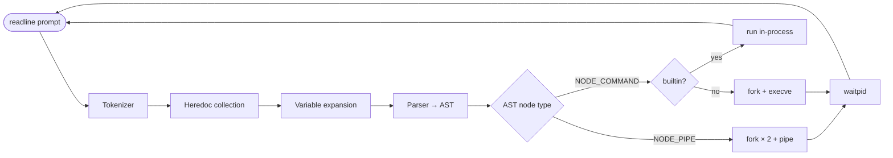

<div align="center">

<!-- Animated capsule banner -->


<!-- Animated typing intro -->
<a href="#">
  
</a>

# 🐚 minishell

*This project has been created as part of the 42 curriculum by ekarout, achoukei*

**A minimalist, POSIX-inspired Unix shell written in C — built from scratch as a tribute to `bash`.**


<br />

<!-- Animated demo loop -->


<br />

</div>

---

## 📑 Table of Contents

1. [📖 About](#-about)
2. [✨ Features](#-features)
3. [🎬 Demo](#-demo)
4. [📂 Project Structure](#-project-structure)
5. [🏛️ Architecture Overview](#️-architecture-overview)
6. [🔁 The Pipeline: From Keystroke to Process](#-the-pipeline-from-keystroke-to-process)
7. [🛠️ Build & Install](#️-build--install)
8. [🚀 Usage](#-usage)
9. [💡 Examples](#-examples)
10. [⚙️ Built-in Commands](#️-built-in-commands)
11. [🔣 Operators & Special Characters](#-operators--special-characters)
12. [📡 Signal Handling](#-signal-handling)
13. [🧹 Memory Management](#-memory-management)
14. [🚦 Error Codes](#-error-codes)
15. [🧪 Testing](#-testing)
16. [🗺️ Roadmap](#️-roadmap)
17. [👥 Authors](#-authors)
18. [📚 Resources](#-resources)
19. [📝 License](#-license)

---

<div align="center">


</div>

## 📖 About

**`minishell`** is a 42 school project that reimplements a subset of `bash`. The goal is simple to state but deep to execute: take a line of text typed by a user, understand it the way a real shell would (quoting rules, environment variable expansion, redirections, pipelines, here-documents), and then run it — all while keeping the terminal interactive, the signals correct, and not a single byte of memory leaked.

This shell is not a toy; it implements:

- A **lexer** that respects single quotes, double quotes, escapes, and operator precedence.
- A **parser** that builds a binary AST of pipelines and commands.
- An **executor** that runs builtins in-process, forks for externals, wires up `pipe(2)` and `dup2(2)` for redirections, and reaps children correctly.
- A **here-document** subsystem (`<<`) with optional variable expansion based on delimiter quoting.
- A **garbage collector** for ergonomic, leak-free per-command allocation lifetimes.
- A **signal layer** that switches behavior cleanly between prompt, execution, and heredoc modes.

> Roughly **5,400 lines of C** across **104 files** — broken into a small header per concern, and one source file per responsibility.

<div align="center">


</div>

## ✨ Features

| Category | Feature | Notes |
|---|---|---|
| Prompt | Interactive line-editing | via GNU `readline` |
| Prompt | Command history | `add_history` + `rl_clear_history` |
| Lexer | Single & double quotes | `'` preserves literally, `"` allows `$` expansion |
| Lexer | Operators | <code>&#124;</code>, `<`, `>`, `<<`, `>>` |
| Parser | Pipelines | left-associative AST of `t_ast` nodes |
| Parser | Multiple redirections per command | applied in order |
| Expansion | `$VAR` / `${VAR}` | expanded outside single quotes |
| Expansion | `$?` | last child's exit status |
| Expansion | Empty-expansion word splitting | unquoted `$EMPTY` removes the word |
| Heredoc | `<< DELIM` | with expansion |
| Heredoc | `<< "DELIM"` / `<< 'DELIM'` | quoted delimiter disables expansion |
| Heredoc | `Ctrl-D` / `Ctrl-C` aware | clean exit, correct fd cleanup |
| Builtins | `echo`, `cd`, `pwd`, `export`, `unset`, `env`, `exit` | full options where the subject requires |
| Execve | `$PATH` resolution | walks `PATH`, checks each candidate |
| Signals | `Ctrl-C`, `Ctrl-D`, `Ctrl-\` | matches `bash` behaviour at the prompt |
| Memory | Custom GC | per-command + permanent lifetimes |

<div align="center">


</div>

## 🎬 Demo

```text
$ ./minishell
minishell$ echo "Hello, $USER — your shell PID is $$"
Hello, ekarout — your shell PID is 42
minishell$ ls -la | grep ".c$" | wc -l
   42
minishell$ cat << EOF > /tmp/note
> minishell rocks
> EOF
minishell$ cat /tmp/note
minishell rocks
minishell$ export FOO=bar && echo $FOO
bar
minishell$ exit
exit
$
```

<div align="center">


</div>

## 📂 Project Structure

```
minishell/
├── Makefile                       # Build entry: all / clean / fclean / re
├── main.c                         # Shell loop: readline → parse → execute
├── .gitignore
│
├── includes/                      # Public header files (one per concern)
│   ├── minishell.h                # Master header — pulls in everything
│   ├── data.h                     # Core typedefs: t_token, t_ast, t_env, t_vars, t_gc
│   ├── built_ins.h                # Builtin command prototypes
│   ├── environ.h                  # Linked-list environment API
│   ├── export_environ.h           # Sorted "export" view of the environment
│   ├── execute.h                  # Executor + redirections + heredoc API
│   ├── expansion.h                # Variable expansion API
│   ├── garbage_collector.h        # Allocation tracking helpers
│   ├── parse.h                    # Tokenizer + parser API
│   ├── signals.h                  # Signal handlers per shell mode
│   └── errors.h                   # Centralized error reporting
│
├── libft/                         # 42's libc subset — strings, lists, printf helpers
│   ├── Makefile
│   ├── ft_*.c                     # String, memory, list, conversion helpers
│   ├── libft.h
│   └── get_next_line/             # Line-buffered input reader
│
└── src/
    ├── built_ins/                 # Internal command implementations
    │   ├── ft_echo.c              #   echo [-n] ...
    │   ├── ft_cd.c, ft_cd_helper.c#   cd [dir | - | ~]
    │   ├── ft_pwd.c               #   pwd
    │   ├── ft_env.c               #   env
    │   ├── ft_export.c, ft_export_all.c, ft_export_utils.c
    │   ├── ft_unset.c             #   unset KEY...
    │   ├── ft_exit.c              #   exit [n]
    │   ├── environ.c              #   linked-list env
    │   ├── environ_mehods.c       #   add / find / replace
    │   └── environ_utils.c
    │
    ├── parse/                     # Lexer + parser (input → token stream → AST)
    │   ├── tokenize.c             #   raw input → t_token list
    │   ├── token_utils.c          #   add_token, create_token
    │   ├── token_get_index.c      #   quote-aware index advance
    │   ├── syntax.c               #   syntax validation (unmatched quotes, etc.)
    │   ├── utils.c                #   skip_spaces, is_quote, is_operator
    │   ├── parse.c                #   recursive-descent: pipelines & commands
    │   ├── parse_utils.c          #   AST mutation helpers
    │   ├── tree_nodes.c           #   create_command_node / create_pipe_node
    │   ├── redirect.c             #   redirection token validation
    │   ├── expansion.c            #   $VAR / $? expansion
    │   ├── expansion_counter.c    #   pre-compute output buffer size
    │   ├── expansion_tokens.c     #   token splitting after expansion
    │   ├── expansion_helper.c
    │   ├── expand_heredoc.c       #   heredoc body expansion
    │   └── heredoc_line_expansion.c
    │
    ├── execution/                 # Runtime — the actual "doing"
    │   ├── execute.c              #   AST walker (PIPE / COMMAND)
    │   ├── execute_utils.c        #   $PATH lookup, builtin dispatch
    │   ├── process_helpers.c      #   fork / dup2 / waitpid orchestration
    │   ├── redirections.c         #   < > >> open() + dup2()
    │   ├── heredoc.c              #   << pipeline-driven heredoc collection
    │   └── heredoc_readline.c     #   line-by-line heredoc input loop
    │
    ├── helpers/                   # Cross-cutting infrastructure
    │   ├── garbage_collector.c    #   t_gc list — track every alloc, free as a unit
    │   ├── libft_allocate.c       #   ft_strdup_allocate, ft_substr_allocate, …
    │   ├── libft_allocate_cont.c
    │   ├── ft_split_set.c         #   split on a *set* of delimiters
    │   ├── signals.c              #   sigint_prompt / sigint_exec
    │   └── signals_helpers.c
    │
    └── errors/                    # User-facing diagnostics
        ├── built_ins_errors.c     #   "minishell: cd: no such file or directory"
        └── parse.errors.c         #   "minishell: syntax error near unexpected token"
```

<div align="center">


</div>

## 🏛️ Architecture Overview

At the highest level, the shell is a **read-parse-eval loop**:



### Core data structures

```c
/* A token from the lexer */
typedef struct s_token {
    t_token_type    type;          /* WORD | PIPE | REDIR_IN | REDIR_OUT | … */
    char           *value;
    struct s_token *next;
} t_token;

/* An AST node — either a leaf command or an internal PIPE */
typedef struct s_ast {
    t_node_type     type;          /* NODE_COMMAND | NODE_PIPE              */
    char          **argv;          /* command + args (NODE_COMMAND only)    */
    t_redir        *redir;         /* < > << >> chain                       */
    struct s_ast  *left;
    struct s_ast  *right;
} t_ast;

/* A redirection — accumulates per-command */
typedef struct s_redir {
    t_token_type    type;          /* REDIR_IN | REDIR_OUT | APPEND | HEREDOC */
    char           *file;          /* filename or heredoc delimiter         */
    int             fd;            /* opened fd (heredoc only)              */
    struct s_redir *next;
} t_redir;

/* The shell's single source of truth */
typedef struct s_vars {
    t_env  **env;            /* runtime environment — linked list          */
    t_env  **exp;            /* sorted "export" view                       */
    int      exit_code;      /* $? for the next expansion                  */
    int      line_counter;
    char    *executer_name;  /* argv[0] — used in error messages           */
    char    *input;
} t_vars;
```

### Example AST: `cat file.txt | grep foo > out.txt`

```
                      ┌──────────┐
                      │ NODE_PIPE│
                      └──┬────┬──┘
              ┌──────────┘    └─────────────┐
              ▼                             ▼
      ┌──────────────┐              ┌──────────────┐
      │ NODE_COMMAND │              │ NODE_COMMAND │
      │ argv = [cat, │              │ argv = [grep,│
      │   file.txt]  │              │   foo]       │
      │ redir = NULL │              │ redir = ─────┼──▶ REDIR_OUT "out.txt"
      └──────────────┘              └──────────────┘
```

<div align="center">


</div>

## 🔁 The Pipeline: From Keystroke to Process

Below is the life of a single command line.

### 1 — Read

The main loop calls `readline("minishell$ ")`. Signals are pre-armed for **prompt mode**: `Ctrl-C` redraws an empty prompt; `Ctrl-D` on an empty line exits cleanly.

### 2 — Tokenize

`tokenize()` walks the input character by character. Quote state is tracked so that `|`, `<`, `>` inside quotes become part of a `WORD` rather than operators.

| Input segment | Emitted token |
|---|---|
| `echo` | `WORD("echo")` |
| `"hello world"` | `WORD("hello world")` |
| <code>&#124;</code> | `PIPE` |
| `>` | `REDIR_OUT` |
| `>>` | `REDIR_APPEND` |
| `<<` | `HEREDOC` |

### 3 — Heredoc Collection

Before expansion, `check_heredoc()` walks the token list and, for every `<< DELIM`, opens a pipe and reads lines until `DELIM`. If `DELIM` was originally quoted, the body is **not** expanded; otherwise `$VAR` and `$?` inside the body are substituted line-by-line.

### 4 — Expansion

`param_expand()` walks each `WORD` token and replaces `$VAR` / `${VAR}` / `$?` with their values. Crucially:

- `'$HOME'` → literal `$HOME`
- `"$HOME"` → expansion result
- `$EMPTY` (unquoted, undefined) → token is **removed** (true word-split semantics)
- `"$EMPTY"` → empty string (token preserved)

### 5 — Parse

A recursive-descent parser produces the AST:

```
pipeline := command (PIPE command)*
command  := (WORD | redirection)+
```

Each `PIPE` token becomes an internal `NODE_PIPE` with the left-hand side already-parsed and the right-hand side parsed recursively. Redirections **never** become AST nodes — they accumulate on the owning `NODE_COMMAND` in a `t_redir` linked list, in source order.

### 6 — Execute

```mermaid
flowchart TD
    Start[execute_ast] --> Type{type?}
    Type -->|NODE_PIPE| Pipe[execute_pipe]
    Type -->|NODE_COMMAND| Cmd[execute_command]

    Pipe --> P1[pipe&#40;fd&#41;]
    P1 --> P2[fork left]
    P2 --> P3[fork right]
    P3 --> P4[parent waits]

    Cmd --> R1[apply_redirections]
    R1 --> Bi{builtin?}
    Bi -->|yes| Bi1[handle_built_ins]
    Bi -->|no| F[fork &amp; execve]
    Bi1 --> R2[restore stdio]
    F --> Wait[waitpid]
    Wait --> Done
    R2 --> Done
```



A subtle but critical detail: **builtins that modify shell state** (`cd`, `export`, `unset`, `exit`) must run in the **parent** process when they're not in a pipeline. If they ran in a fork, their effects (a changed working directory, a new env entry, the shell exiting) would die with the child.

### 7 — Cleanup

After the AST is walked, `close_heredoc_fds()` closes any leftover heredoc fds and `free_garbage(&gc)` releases everything allocated during this single command. The permanent GC (env strings, history) survives.

<div align="center">


</div>

## 🛠️ Build & Install

### Requirements

- `gcc` or `clang`
- GNU **`readline`** (`libreadline-dev` on Debian/Ubuntu)
- `make`

### Compile

```bash
git clone https://github.com/<your-username>/minishell.git
cd minishell
make
```

### Makefile targets

| Target | Effect |
|---|---|
| `make` / `make all` | Build `libft` then `minishell` |
| `make clean` | Remove all `.o` files |
| `make fclean` | `clean` + remove `minishell` binary and `libft.a` |
| `make re` | `fclean` + `all` |

### Compiler flags

`-Wall -Wextra -Werror -g` — strict warnings as errors plus debug symbols. The linker pulls in `-lreadline` and the in-tree `libft.a`.

<div align="center">


</div>

## 🚀 Usage

```bash
./minishell
```

That's it. You're now in the shell. Type commands; press `Enter` to run; `Ctrl-D` or `exit` to leave.

### Quick keys

| Keys | Action |
|---|---|
| `Ctrl-C` (at prompt) | Cancel current line, redraw prompt |
| `Ctrl-D` (empty line) | Exit shell |
| `Ctrl-\` (at prompt) | Ignored (matches bash) |
| `↑` / `↓` | Browse history |
| `Tab` | (readline default — no custom completion) |

<div align="center">


</div>

## 💡 Examples

### Basic commands

```bash
minishell$ pwd
/home/user/projects
minishell$ ls -la
total 24
drwxr-xr-x 5 user user 4096 May  7 20:53 .
drwxr-xr-x 9 user user 4096 May  7 20:50 ..
-rw-r--r-- 1 user user 1678 May  7 20:53 Makefile
...
```

### Quoting

```bash
minishell$ echo 'this $VAR is literal'
this $VAR is literal
minishell$ echo "this $USER is expanded"
this ekarout is expanded
minishell$ echo "mixed '$USER' quote"
mixed 'ekarout' quote
```

### Pipelines

```bash
minishell$ cat /etc/passwd | grep root | wc -l
1
minishell$ ls -la | sort -k5 -n | tail -3
```

### Redirections

```bash
minishell$ echo "first line" > file.txt
minishell$ echo "second line" >> file.txt
minishell$ wc -l < file.txt
2
minishell$ cat << EOF
> $USER's notes
> line two
> EOF
ekarout's notes
line two
```

### Heredoc with quoted delimiter (no expansion)

```bash
minishell$ cat << 'EOF'
> $HOME stays literal
> $? stays literal
> EOF
$HOME stays literal
$? stays literal
```

### Environment manipulation

```bash
minishell$ export PROJECT=minishell
minishell$ echo $PROJECT
minishell$ env | grep PROJECT
PROJECT=minishell
minishell$ unset PROJECT
minishell$ echo "[$PROJECT]"
[]
```

### Exit status (`$?`)

```bash
minishell$ ls /nonexistent
ls: cannot access '/nonexistent': No such file or directory
minishell$ echo $?
2
minishell$ true && echo $?
0
```

### Multi-stage pipelines with redirection

```bash
minishell$ grep -v "^#" /etc/hosts | awk '{print $2}' | sort -u > /tmp/hosts.txt
minishell$ wc -l < /tmp/hosts.txt
8
```

<div align="center">


</div>

## ⚙️ Built-in Commands

| Command | Synopsis | Description |
|---|---|---|
| `echo` | `echo [-n] [args...]` | Write args to stdout, separated by spaces. `-n` suppresses trailing newline. |
| `cd` | `cd [dir]` | Change directory. With no arg, goes to `$HOME`. `cd -` returns to `$OLDPWD`. Updates `PWD` and `OLDPWD`. |
| `pwd` | `pwd` | Print current working directory. |
| `export` | `export [KEY[=VALUE]]` | Add/update env variable. With no args, list all (sorted). |
| `unset` | `unset KEY [KEY...]` | Remove env variables. Silently skips invalid keys. |
| `env` | `env` | List `KEY=VALUE` for every exported variable that has a value. |
| `exit` | `exit [n]` | Leave the shell with status `n` (default `$?`). Errors on non-numeric arg. |

### Why two env structures?

The shell maintains **two** linked lists derived from `envp`:

- `vars->env` — the **runtime** environment, used for expansion and passed to children. Mirrors what `env` shows.
- `vars->exp` — a **sorted** view that matches `bash`'s `export` output, including keys without values (`export FOO`).

`export FOO` adds `FOO` to `exp` only; `export FOO=bar` adds it to both. This split is the cleanest way to mirror bash's distinction between "marked for export" and "has a value right now."

<div align="center">


</div>

## 🔣 Operators & Special Characters

| Operator | Name | Behavior |
|---|---|---|
| <code>&#124;</code> | Pipe | stdout of LHS becomes stdin of RHS |
| `<` | Input redirect | open file as stdin |
| `>` | Output redirect | truncate file, open as stdout |
| `>>` | Append redirect | open file in append mode as stdout |
| `<<` | Heredoc | read until delimiter, feed as stdin |
| `'…'` | Single quotes | literal — nothing inside expands |
| `"…"` | Double quotes | preserves spaces, allows `$` expansion |
| `$VAR` | Variable | expands to value or empty |
| `$?` | Exit status | last foreground command's exit code |
| `\` | (not supported) | the 42 subject does not require backslash escaping |

### Quote-state machine

```
                     ┌─────────────┐
            ' read   │             │  ' read
            ┌───────▶│   SINGLE    │────────┐
            │        │   QUOTE     │        │
            │        └─────────────┘        │
            │                               ▼
    ┌─────────────┐                 ┌─────────────┐
    │  NO_QUOTE   │◀────────────────│  NO_QUOTE   │
    └─────────────┘                 └─────────────┘
            │                               ▲
            │        ┌─────────────┐        │
            │ " read │             │ " read │
            └───────▶│   DOUBLE    │────────┘
                     │   QUOTE     │
                     └─────────────┘
```

The lexer carries this state across the entire input. Operators encountered inside `SINGLE_QUOTE` or `DOUBLE_QUOTE` lose their special meaning.

<div align="center">


</div>

## 📡 Signal Handling

The shell needs **three different signal regimes**:

| Mode | `SIGINT` (Ctrl-C) | `SIGQUIT` (Ctrl-\) | `EOF` (Ctrl-D) |
|---|---|---|---|
| **Prompt** | New prompt, `$? = 130` | Ignored | Exit shell |
| **Execution** (child running) | Default — kills child | Default — core dump | Passed to child stdin |
| **Heredoc** | Abort heredoc, `$? = 130` | Ignored | End of heredoc (warning) |

These are switched by `setup_signals_prompt()`, `setup_signals_exec()`, `setup_signals_heredoc()` — each tweaks `signal(2)` handlers and `readline`'s internal flags.

The single allowed global, `g_signal`, holds the most recent signal number. Signal handlers do nothing but write to it; the main loop reads and acts on it. This pattern keeps everything **async-signal-safe**.

<div align="center">


</div>

## 🧹 Memory Management

A bash-like shell allocates *constantly* — every expansion, every token, every AST node, every argv array. Tracking each `malloc` manually would be tedious and bug-prone, so `minishell` uses a **two-tier garbage collector**:

```
  ┌─────────────────────────────────────────────────────────┐
  │  perm_gc  (lifetime: process)                           │
  │  ─ environment strings                                  │
  │  ─ readline history (via readline)                      │
  └─────────────────────────────────────────────────────────┘

  ┌─────────────────────────────────────────────────────────┐
  │  gc        (lifetime: one command)                      │
  │  ─ tokens                                               │
  │  ─ AST                                                  │
  │  ─ argv arrays                                          │
  │  ─ expanded strings                                     │
  └─────────────────────────────────────────────────────────┘
                             │
                             ▼
              free_garbage(&gc) at end of read_input()
```

Every helper allocator (`ft_strdup_allocate`, `ft_substr_allocate`, `ft_split_allocate`, etc.) takes a `t_gc **` and pushes the pointer onto the list. When the list is freed, every allocation is reclaimed in one sweep. The result: **zero leaks** under `valgrind --leak-check=full`, even on syntax errors mid-pipeline.

<div align="center">


</div>

## 🚦 Error Codes

Following bash conventions:

| Code | Meaning |
|---|---|
| `0` | Success |
| `1` | General error / builtin failure |
| `2` | Misuse / syntax error |
| `126` | Found but not executable |
| `127` | Command not found |
| `130` | Terminated by `SIGINT` (Ctrl-C) |
| `131` | Terminated by `SIGQUIT` (Ctrl-\\) |

<div align="center">


</div>

## 🧪 Testing

### Manual sanity check

```bash
make re
./minishell <<'EOF'
echo hello
ls | grep .c | wc -l
export FOO=bar
echo $FOO
unset FOO
echo "[$FOO]"
exit 42
EOF
echo "exit code: $?"
```

### Memory testing

```bash
valgrind --leak-check=full \
         --show-leak-kinds=all \
         --suppressions=readline.supp \
         ./minishell
```

A `readline.supp` is recommended because GNU `readline` itself leaks small allocations during initialization that are out of scope for the project.

### Recommended tester

External tester compatibility:

- [`minishell_tester`](https://github.com/zstenger93/42_minishell_tester) — broad behavioral coverage
- Hand-rolled diff against `bash --posix` for tricky quoting cases

<div align="center">


</div>

## 🗺️ Roadmap

Ideas that go *beyond* the 42 subject and would make a fun follow-up:

- [ ] Logical operators `&&` and `||`
- [ ] Subshell grouping `( ... )`
- [ ] Wildcard expansion (`*`, `?`)
- [ ] Backslash escapes outside quotes
- [ ] Tab completion for paths and builtins
- [ ] `~user` expansion
- [ ] Job control (`&`, `fg`, `bg`, `jobs`)

<div align="center">


</div>

## 👥 Authors

| Login | Role |
|---|---|
| **ekarout** | Lexer, expansion, executor, heredoc, signals |
| **achoukei** | Parser, AST, redirections, garbage collector |

Built as part of the **42 Common Core** curriculum.

<div align="center">


</div>

## 📚 Resources

The implementation drew heavily on:

- The **POSIX.1-2017** specification — *Shell Command Language* (chapter 2)
- The **GNU `bash` manual** — for behavior to mirror
- *Advanced Programming in the Unix Environment* by W. Richard Stevens — pipes, fork, exec, signals
- The **`readline` API** — `readline(3)`, `add_history(3)`, `rl_clear_history(3)`
- 42's internal `libft` — string and list utilities

<div align="center">


</div>

## 📝 License

This project is released under the **MIT License**. Educational fork; do not submit as your own 42 work.
